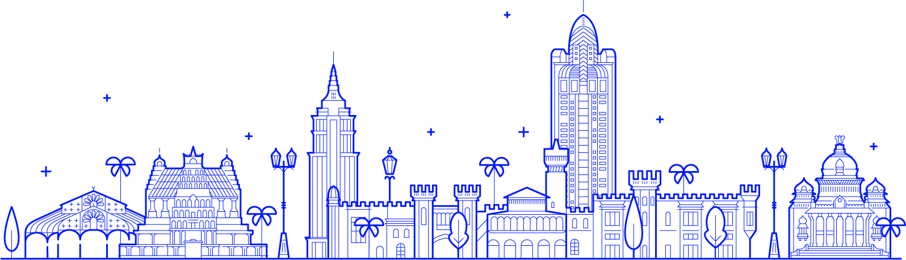

# Hi 👋 I am Archit. अहं अर्चित अस्मि।

  
  
  

<h3 align="center">🚀 About Me</h3>

  Learner | Innovator | Builder

  I'm a Developer and Hackathon Enthusiast with a strong focus on creating user-friendly experiences. I bring technical expertise and creativity to every project. Committed to continuous learning, I stay current with the latest trends and technologies in the tech industry. Beyond coding, I find inspiration in nature, space, and the vast mysteries of the universe.

---
