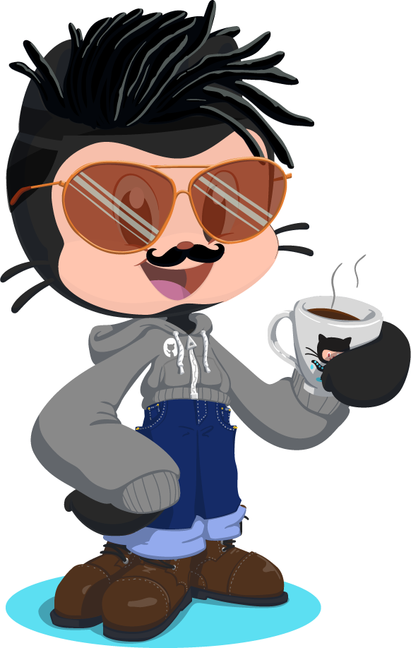
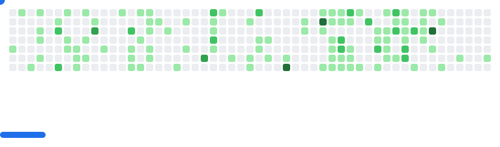

---
# Hi 👋 I am [Archit](https://architjain.dev/). अहं [अर्चित](https://architjain.dev/) अस्मि।

  
  
  
  
  

  

<h3 align="center">
  
</h3>

Dreamer | Developer | Builder with a Product Mindset

I love building solutions that bring value to lives. 💡

Full-Stack JavaScript Engineer | Cloud & DevOps Practitioner | Hackathon Enthusiast. Passionate about solving real-world problems with code and collaborating on innovative projects.

Always exploring, always building. Open to collaborations!

---

 

> 📫 Feel free to reach out: [archit@architjain.dev](mailto:archit@architjain.dev)

An aesthete admiring the mysteries of the universe. ✨

---

  

---

  <picture align="center">
  <source media="(prefers-color-scheme: dark)" srcset="images/breakout-dark.svg" />
  <source media="(prefers-color-scheme: light)" srcset="images/breakout-light.svg" />
  
</picture>

---

  

---

---
